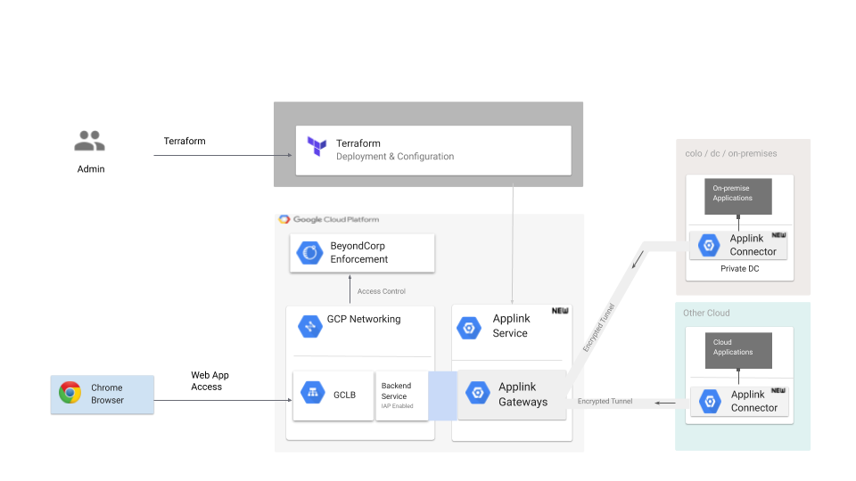

# Getting Started: BeyondCorp Enterprise (BCE) Applink for Securing Remote Application(s)

This document provides a step-by-step walk-through of implementing Google’s
BeyondCorp Enterprise (BCE) Applink, which allows customers to secure workloads
resident in non-GCP environments using Cloud Identity-Aware Proxy. It covers
both the GCP and the remote/on-premise applink components.

For a more thorough description of the BCE Applink solution please refer to
[Overview](#overview).

The solution uses Terraform to actuate the resources required to enable
connectivity to remote applications.

#### Table of Contents

[Overview](#overview)

*   [Customer Onboarding](#customer-onboarding)

[Prerequisites](#prerequisites)

[Setup/Topology](#setuptopology)

[Step-by-Step Deployment](#step-by-step-deployment)

[Help](#help)

## Overview

[Cloud Identity-Aware Proxy](https://cloud.google.com/iap/docs/concepts-overview)
(Cloud IAP) controls access to your cloud applications running on Google Cloud
Platform (GCP). Cloud IAP works by verifying user identity and context of the
request to determine if a user should be allowed to access the application.
Cloud IAP is a building block toward
[BeyondCorp](https://cloud.google.com/beyondcorp/), an enterprise security model
that enables every employee to work from untrusted networks without the use of a
VPN.

The BeyondCorp Enterprise (BCE) Applink builds on Cloud IAP to provide a secure,
authenticated, interface between a customer’s applications running in a non-GCP
environment, and the BeyondCorp Enterprise enforcement plane running on GCP.

The Applink connectivity is implemented as a TCP proxy that is distributed
between the GCP and customer environments. The TCP proxy has a user facing
component that is resident in GCP and an application facing component resident
in the enterprise environments. Unlike traditional proxies where these two parts
are implemented in a single software package, the TCP proxy for BCE application
connectivity implements these two functions as separate components, **wired
together over secure tunnels initiated from the customer premise (i.e no need to
open up firewalls)**.

This document provides a walk-through of implementing Google’s BCE Applink.
Since the Applink data plane is distributed between GCP, and the customer
networks(on-prem | other clouds), there is a need to actuate and lifecycle
manage GCP components as well as remote components.

*   The user facing component is called the Applink Gateway. The Applink gateway
    is exposed to the users via the Cloud HTTPS load balancer.
*   The Cloud Identity Aware Proxy is enabled on the the Cloud HTTPS load
    balancer to implement context aware access controls.
*   The app facing component is called the Applink Connector. The Applink
    Connector creates tunnel connections with the Applink Gateway to enable
    application connectivity.
*   The GCP components needed are actuated using
    [Terraform](https://www.terraform.io/) templates leveraging existing
    resources of the
    [google](https://www.terraform.io/docs/providers/google/index.html)/google-beta
    provider.
*   The remote configuration involves setting up a VM and deploying a Google
    provided Docker image to establish connectivity between remote applications
    and BCE control-plane running on GCP.

### Customer Onboarding

Customer onboarding is handled using an early access tool called Washboard. You
can sign up through a Google Form to request to be whitelisted in order to
access the Gateway and Connector Docker images. **Please reach out to your
Account Team or bce-applink-users@google.com if you need any help accessing the
preview**.

## Prerequisites

*   Terraform
*   Linux VM running Docker to run the connector software \
    Preferred distributions include:
    *   Debian 10.7 (buster)
    *   Red Hat Enterprise Linux Server 7.8 (Maipo) x86_64
    *   Ubuntu 16.04 or above
*   The target remote application must be accessible via an IP address in the
    customer remote network and accept TCP traffic from within the remote
    network. The remote application must be reachable from the connector VM
    instance, which typically is running in the same remote network.
*   A DNS hostname that will be used as the ingress point to IAP. You can
    [register a domain on Google Domains](https://support.google.com/domains/answer/4491208),
    or use the domain registrar of your choice.
    *   In this guide we would use *apache.beyondcorp.us* as a test FQDN.
*   A SSL/TLS certificate for the DNS hostname.
    *   In the setup below, a
        [Google managed](https://cloud.google.com/load-balancing/docs/ssl-certificates/google-managed-certs)
        certificate was generated and used; however, a customer can bring their
        own certificate or simply generate one that is self-signed (browser will
        naturally throw a warning if self-signed).

## Setup/Topology

*   For the setup in this document we simulate a remote application by using an
    instance of Apache web server.
*   **2 GCP projects (Project A, B) would be used for the end-to-end
    deployment.**
    *   Project A would be used to simulate the remote enterprise environment.
        It includes:
        *   A "connector" VM running the aforementioned Google provided Docker
            image.
        *   The Apache web server to act as the remote application. It can be
            deployed anywhere as long as it's accessible via an IP address to
            the connector VM.
    *   Project B would contain the necessary BCE GCP components.
        *   The main component is a Managed Instance Group Instance running
            custom google software "*Gateways*" to receive connections from the
            connector VM.
        *   A cloud storage bucket is created to store the config metadata for
            "connector" to establish connectivity with the "Gateway".

More complex topologies with multiple applications, connector VMs and Gateways
can be built as desired. For the sake of simplicity this document demonstrates a
minimal setup.

## Step-by-Step Deployment

1.  [Create](gcp-project-setup.md) GCP projects A and B.
2.  [Set up](remote-app-setup.md) your remote application in GCP project A.
3.  [Configure](terraform-config.md) your GCP project B using Terraform scripts.
4.  [Set up](connector-setup.md) the Connector VM in GCP project A.
5.  [Publish](iap-lb-setup.md) application using Identity Aware Proxy.

## Help
[FAQs](faqs.md)
