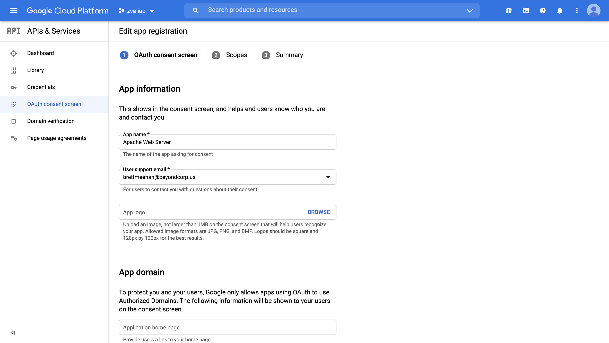

### GCP Consumer Project Setup

1.  Create a
    [GCP Project](https://cloud.google.com/resource-manager/docs/creating-managing-projects).
    The GCP project will be used to hold all the resources needed to enable
    connectivity and to create access control policies. Setup Billing & enable
    compute engine & IAP APIs on the project.

    ```
    $ gcloud projects create [PROJECT_ID]

    $ gcloud beta billing projects link PROJECT_ID --billing-account=ACCOUNT_ID

    $ gcloud services enable compute.googleapis.com

    $ gcloud services enable iap.googleapis.com

    ```

2.  Contact the GCP team to receive a Private Preview sign-up form. Fill out the
    form using the project you just created. Once you've submitted the form and
    your request is approved by the GCP team, you should receive a welcome
    email. After you receive the email, you should have access to the Docker
    images needed for later steps.

3.  Configure the project's OAuth consent screen as detailed
    [here](https://cloud.google.com/iap/docs/tutorial-gce#set_up_iap).

    1.  The first time you configure IAP, you will need to configure the consent
        screen at Cloud Console -> APIs & Services -> OAuth consent screen.

    2.  In the “App name” field, enter the name of your application. Fill out
        the "User support email" field and the "Developer contact information"
        section as well, then click “Save”.



[Next: Configure your GCP project using Terraform scripts](terraform-config.md)
