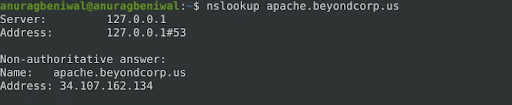
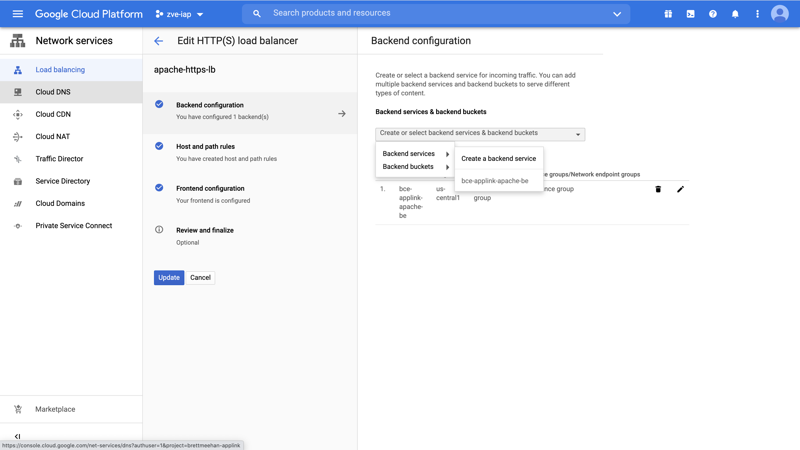
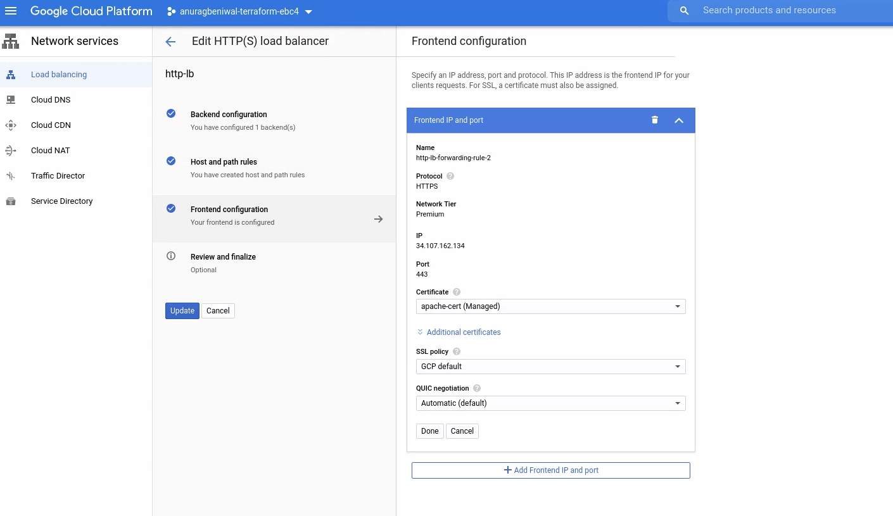
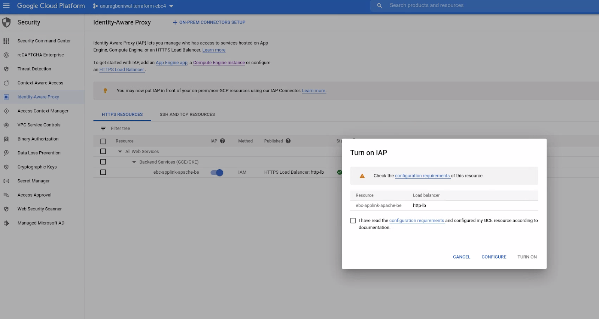
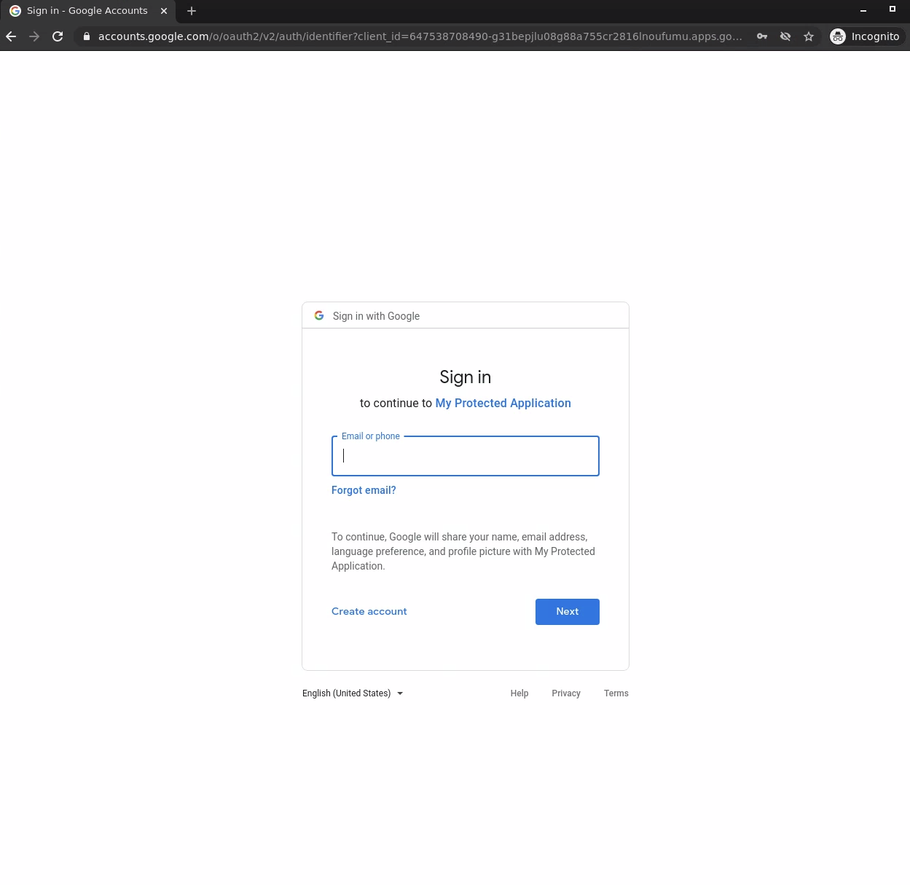
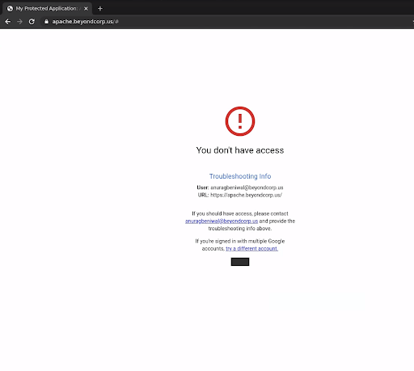
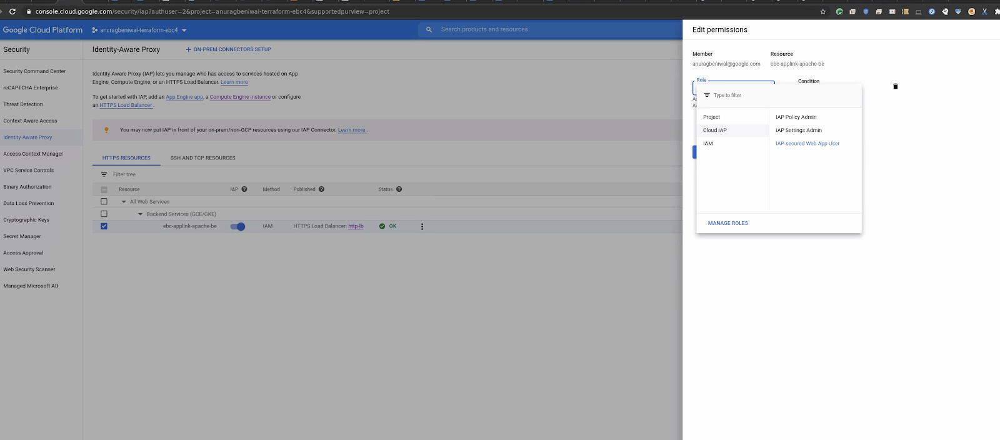
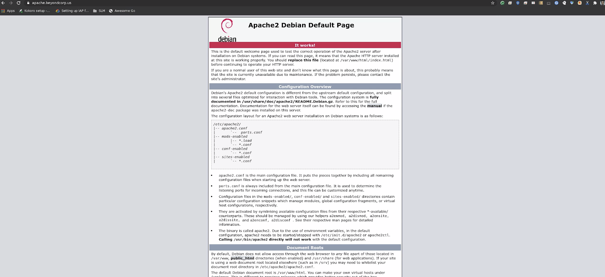

# Cloud Identity Aware Proxy with HTTPS Load Balancer Setup

**NOTE: To simplify the deployment most parts of the following load balancer
setup were automated in the single-app example for the
[Gateway](terraform-config.md#applink-gateway). You could refer to the example
scripts to add similar automation for your desired Application setup using the
underlying BCE Gateway module.**

Cloud Identity Aware Proxy(IAP) provides context aware authentication &
authorization for applications accessed by HTTPS. Each individual remote app
maps to a GCP backend service.

In this step we would set up the
[External HTTPS Load Balancer](https://cloud.google.com/load-balancing/docs/https)
and configure Identity Aware Proxy.

#### Table of Contents

*   [Domain Name and Certificate](#domain-name-and-certificate)

*   [Load Balancer](#load-balancer)

*   [Enable IAP](#enable-iap)

*   [Confirming IAP is Enabled](#confirming-iap-is-enabled)

*   [Authorizing Users to Access the Application](#authorizing-users-to-access-the-application)

## Domain Name and Certificate

To use the Load Balancer with HTTPS traffic, you'll need a domain name and a
signed certificate. As stated in the Prerequisites section, you should already
have a DNS hostname and an SSL/TLS certificate available

*   You need an external IP address for the HTTPS Load Balancer Frontend. You
    can reserve one as detailed in
    [this document](https://cloud.google.com/compute/docs/ip-addresses/reserve-static-external-ip-address).
*   [Set up](https://cloud.google.com/iap/docs/tutorial-gce#set_up_your_domain_to_point_to_the_load_balancer)
    your domain to point to the external IP address.
*   Verify the domain points to the external IP address

## Load Balancer

*   In the Cloud Console, go to the Network Services > Create a load balancer
    page
*   Under HTTP(S) Load Balancing, click Start configuration.
*   Select From Internet to my VMs.
*   On the New external HTTP(S) load balancer page that appears, enter a Name
    for your load balancer.
*   Click Backend configuration, then select Backend services >
    *   Pick the backend service returned from output of the
        [Gateway](terraform-config.md#applink-gateway) step.

*   Click Frontend configuration. Use the default values except for the
    following:
    *   **Protocol**: HTTPS
    *   **IP address**: IP address reserved in the
        [Domain Name and Certificate step](#domain-name-and-certificate)
    *   **Certificate**: Your TLS certificate

*   When you're finished entering frontend configuration values, click Done. The
    New external HTTP(S) load balancer panel reappears.

## Enable IAP

*   In the Cloud Console, go to the Security > Identity-Aware Proxy page.

## Confirming IAP is Enabled

Navigate to the external URI to demonstrate IAP is enabled and requesting
authentication--in the case of this guide, we navigate to apache.beyondcorp.us

We have not authorized any users yet so this should fail--we can confirm that we
should be denied access by authenticating with a valid Cloud Identity:

## Authorizing Users to Access the Application

*   In the Cloud Console, go to the Security > Identity-Aware Proxy page.
*   Select the checkbox next to the IAP resource--then click “Add Member”.
*   Enter the Cloud Identity (email address) of the user you want to grant
    access to the remote application.
*   Next, select the IAP-Secured Web App User role, then click “Save”.

Now, we can now confirm that we can access the sample apache server, by
authenticating with a valid Cloud Identity:

At this point we have successfully deployed a fully-functional BeyondCorp
Enterprise (BCE) Applink solution with IAP to secure a remote web application.
