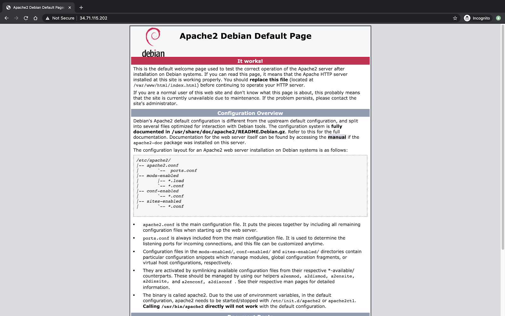

### Application

Identify the remote application that you would like to secure using BCE Applink.
For the purposes of this user guide, a remote application can be simulated using
a VM running in GCP. For a real world use case, please use an application
deployed in your environment.

*   For example, simple Apache web-server running in Project A would be used.
    Please refer to [Create a GCP Project](gcp-project-setup.md) for information
    on setting up this project in GCP.

    *   Deploy a Debian Linux VM in Project A (Google Cloud Console -> Compute
        Engine -> VM Instances -> Create Instance)
    *   Install Apache server on the VM:

        `$ sudo apt-get install apache2`

*   Verify that you can access the application from the remote network using its
    IP address.

    *   Note the internal IP address: This would be used as *app_endpoint* in
        future Terraform configurations.

This user guide will use this application as the target for enabling
connectivity.

[Next: Create a GCP Project](gcp-project-setup.md)
