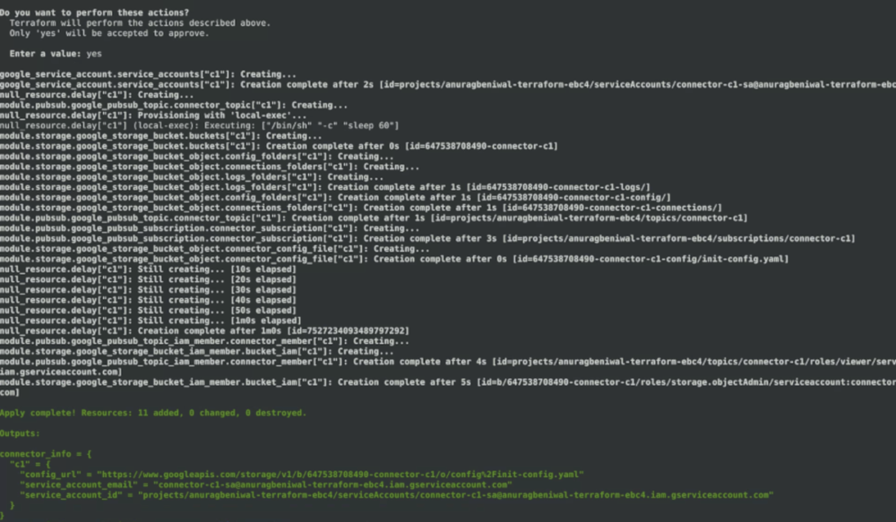
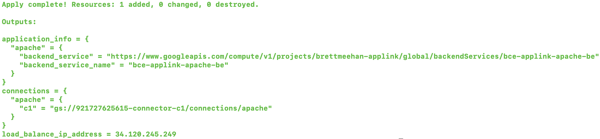

# Terraform Configurations

[Terraform](https://www.terraform.io/) is a tool that allows using
Infrastructure as Code to provision and manage any cloud, infrastructure, or
service. In this step we will use Terraform for actuating the necessary GCP
resources.

*   Download and
    [install Terraform](https://www.terraform.io/intro/getting-started/install.html)
    and read the Terraform getting started guide that follows. This guide will
    assume basic proficiency with Terraform.
*   Configure
    [Google Cloud Terraform provider](https://www.terraform.io/docs/providers/google/index.html).
    The terraform scripts would require Terraform v0.12+ & google providers v3.

#### Table of Contents

*   [Applink Connector](#applink-connector)

*   [Applink Gateway](#applink-gateway)

## Applink Connector

The **Applink Connector** is a Software agent deployed in remote (Non-GCP)
environments that establishes reverse tunnels to GCP over HTTPS. It receives
user traffic from Applink Gateways and forwards the traffic to the application
endpoints. The connector uses a GCP Service Account (provisioned per connector)
as its identity.

This step sets up the necessary metadata in GCP (including the service account)
to bootstrap the remote connector(s).

**NOTE: Please refer to the [README file](terraform/connector/README.md) for the
connector module for the most up to date information about the necessary input &
output configurations.**

**Steps:**

1.  Follow the instructions in the connector
    [README file](terraform/connector/README.md) for Terraform.
2.  For this demo we would configure a single connector with a
    [tfvars file](https://www.terraform.io/docs/configuration/variables.html#variable-definitions-tfvars-files)
    configuration similar to that of the connector
    [sample.tfvars](terraform/connector/sample.tfvars) file.
3.  Run `$ terraform apply -var-file=[FILEPATH]` to actuate the resources. Upon
    successful completion you should see an "Apply Complete" screen as shown
    below with some output information about the connector you just created.
    Please note the output (shown in green) for use in future steps.

## Applink Gateway

The **Applink Gateway** is a software component that enables application
connectivity to remote applications. The Applink gateway accepts tunnel
connections initiated by the Applink Connectors. The Applink Connectors are
expected to have connectivity to the application and can proxy the requests from
the Applink gateway over the tunnel connection. The Applink Gateway is
implemented as VM instances running as a managed instance group in GCP. The
Applink gateway managed instance group acts as a backend service for the
external HTTPS loadbalancer. All requests received by the Applink Gateway from
the external HTTPS loadbalancer will be sent to Applink connector over the
tunnel connection. The requests are delivered to the remote application by the
Applink connector. The responses from the remote application will be sent to the
Applink gateway over the tunnel connection. The Applink gateway will respond to
the end user via the external HTTPS load balancer.

The gateway folder in the Applink Terraform scripts provides modularized
deployment code for BCE Applink Gateway. Use the module to create a solution as
desired for your enterprise application(s). The single-app folder in the
examples subdirectory demonstrates the use of BCE Applink gateway module using
an opinionated setup for a single application.

The example also sets up its IAP OAuth client, configures an external HTTPS load
balancer to forward all traffic directed to the load balancer IP to the IAP
backend service for the application and adds IAM binding for Identity-Aware
Proxy WebBackendService for the application.

**NOTE: Please refer to the
[README file](terraform/gateway/examples/single-app/README.md) for the gateway
module for the most up to date information about the necessary input & output
configurations.**

**Steps:**

1.  For the Gateway we would use the example at
    terraform/gateway/examples/single-app in the repository. Review the
    [README file](terraform/gateway/examples/single-app/README.md) and the
    corresponding variables file.

    1.  The example demonstrates an opinionated setup for a single application.
    2.  A
        [tfvars file](https://www.terraform.io/docs/configuration/variables.html#variable-definitions-tfvars-files)
        with configuration similar to that of the single-app example
        [sample.tfvars file](terraform/gateway/examples/single-app/sample.tfvars)
        in the repo should suffice.
    3.  Follow the instructions in the README file to run terraform. Upon
        successful completion you should see an Apply Complete screen as shown
        below with some output information about the gateway(s) and
        connection(s) you just created. Please note the output for use in future
        steps.

[Next: Set up the Connector VM](connector-setup.md)
